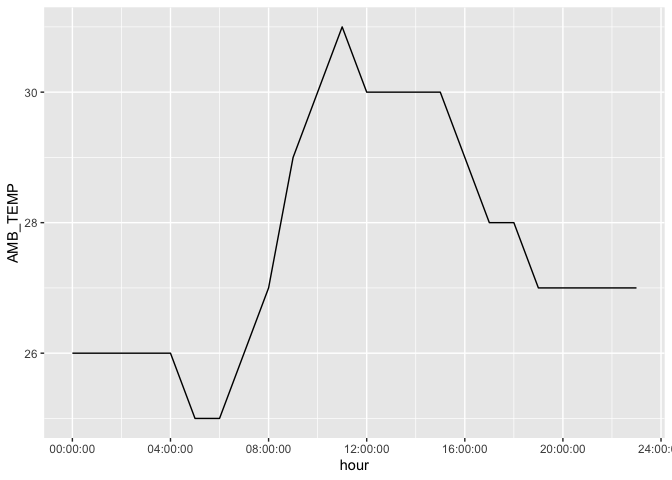
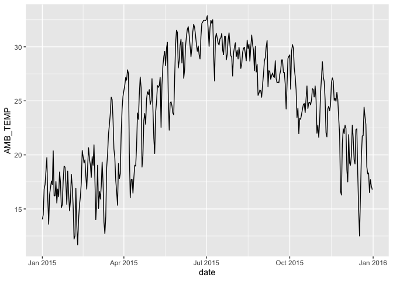
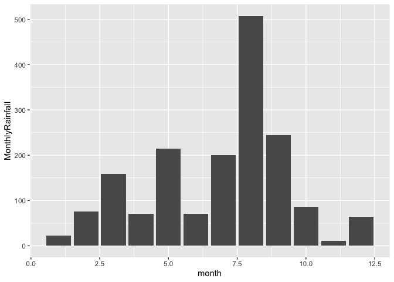
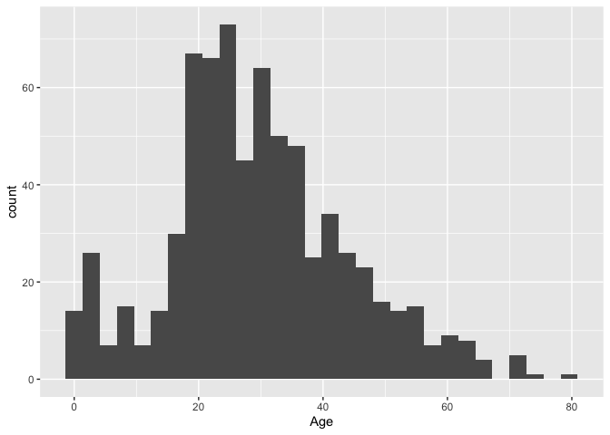
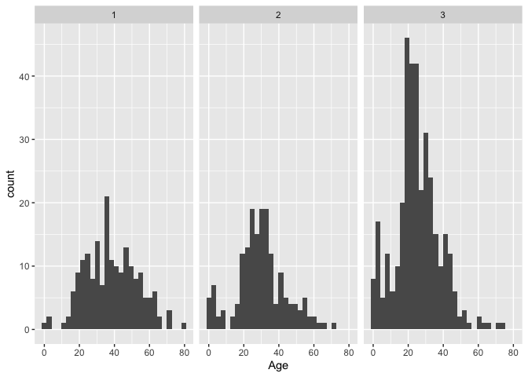
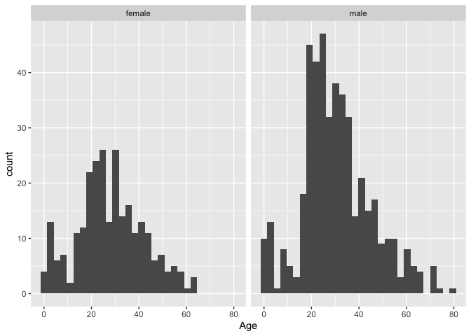

Assignment 5: Data import (readr) and tidy data (tidyr)
================

\#**Instructions: Please read through this before you begin**

  - This homework is due by **10pm on Monday 10/26/20**

  - Please **reproduce this markdown template**. Pay attention to all
    the formating in this file, including bullet points, bolded
    characterrs, inserted code chunks, headings, text colors, blank
    lines, etc.

  - For the first two excercises in this assignment, **import** data
    files into R and **parse** them properly as instructed. **Tidy
    and/or **transform\*\* the data frames when appropriate.
    
      - We have not extensively covered parsing data in lecture, but you
        can find more information about here.
    
      - Briefly, you can choose to use the `col_types` argument in
        a`read_*()` function to parse the data during import.
    
      - In many cases, you can also choose to parse the data using one
        of the `parse_*()` functions nested within a `mutate()` after
        importing the data.
    
      - In many cases, you can choose to parse the data using one of the
        `parse_*()` functions nested within a `mutate()` function after
        importing the data.

  - For the next exercise, you will explore a dataset with details about
    passengers on the Titanic. First, **answer the questions below and
    use figures or tables to support your answer** Then, **explore the
    dataset on your own** using the data transformation and
    visualization skills that you have learned in this so far.
    
      - For this excercise, pleas make sure to put some thought into
        **editing the aesthetics of your figures and tables** to make
        them easier to understand and nicer to look at (e.g. choose the
        most appropriate geometric object, aesthetic mapping, facetting,
        postion adjustment; add meaningful axis lables, figure titles
        legend titile; change the background; be creative; and etc.)

  - Please note that the **excercise 4 is optional**. It is a good
    exercise for practicing your data tidying and exploration skills
    through, so we encourage you to give it a try if time allows.

  - Please **reproduce the tables and plots exactly as shown in this
    markdown file**.

  - When a verbal response is needed, answer by editing the part in the
    R markdown template where it says “Write your response here” .

  - Have all your code embedded within the R markdown file, and show
    both of your **code** and **plots** in the kitted markdown file.
    \*Use R Markdown functionalities to **hide message and warnings when
    needed**. (Suggestion: messages and warnings can often be
    informative and important, so please examine them carefylly and only
    turn them off when you finish the exercise).

  - Please name your R markdown file `assignment_5.Rmd` and the knitted
    markdwon file `assignment_5.md`. Please upload both files using your
    personal GitHub repository for this class.

  - To start, first load all the required packages with the following
    code. Install them if they are not installed yet.

<!-- end list -->

``` r
library(tidyverse)
library(knitr)
```

\#\#\*\*Exercise 1. Tibble and Data Import

Import data frames listed below into R and parse the columns
appropraitly when need ed. Watch out for the formating oddities of each
dataset. Print the results with `kable()`.

1.1 **Create the following tibble manually, first using `tribble()` and
then using `tibble()`. Print both results.**

``` r
tribble(~a,~b, ~c,
        1, 2.1, "apple",
        2, 3.2, "orrange"
        ) %>% 
  kable()
```

| a |   b | c       |
| -: | --: | :------ |
| 1 | 2.1 | apple   |
| 2 | 3.2 | orrange |

``` r
tibble(a = c(1,2),
       b = c(2.1, 3.2), 
       c = c("apple", "orrange"))%>% 
  kable()
```

| a |   b | c       |
| -: | --: | :------ |
| 1 | 2.1 | apple   |
| 2 | 3.2 | orrange |

**1.2 import
`https://raw.githubusercontent.com/nt246/NTRES6940-data-science/master/datasets/dataset2.txt`
into R. Change the column names into “Name”, “Weight”, “Price”.**

``` r
data_Fruit<-read.table("https://raw.githubusercontent.com/nt246/NTRES6940-data-science/master/datasets/dataset2.txt", sep = ",") 

colnames(data_Fruit) <- c("Name", "Weight", "Price")
kable(data_Fruit)
```

| Name   | Weight | Price |
| :----- | -----: | ----: |
| apple  |      1 |   2.9 |
| orange |      2 |   4.9 |
| durian |     10 |  19.9 |

**1.3 Import
`https://raw.githubusercontent.com/nt246/NTRES6940-data-science/master/datasets/dataset3.txt`
into R . Watch out for the first few lines, missing values, separators,
quotation marks, and deliminaters.**

``` r
read_table("https://raw.githubusercontent.com/nt246/NTRES6940-data-science/master/datasets/dataset3.txt")#, row.names = 1)# sep = ",")
```

    ## Parsed with column specification:
    ## cols(
    ##   `Table of fruits` = col_character()
    ## )

    ## # A tibble: 5 x 1
    ##   `Table of fruits`       
    ##   <chr>                   
    ## 1 09/25/18                
    ## 2 /Name/;/Weight/;/Price/ 
    ## 3 /apple/;1;2.9           
    ## 4 /orange/;2;Not Available
    ## 5 /durian/;?;19.9

``` r
Fruit<-read_csv("Name, Weight,Price
         apple,1,2.9
         orange, 2, NA
         durian, NA, 19.9")
kable(Fruit)
```

| Name   | Weight | Price |
| :----- | -----: | ----: |
| apple  |      1 |   2.9 |
| orange |      2 |    NA |
| durian |     NA |  19.9 |

**1.4 Import
`https://raw.githubsercontent.com/nt246/NTRES6940-science/master/datasets/dataset4.txt`
into R. Watch out for comments, units, and decimal markes(which are `,`
in this case).**

``` r
#read_csv("https://raw.githubsercontent.com/nt246/NTRES6940-science/master/datasets/dataset4.txt")#, sep =",")
#hacky hour not working
```

**1.5 import
`https://raw.githubusercontent.com/nt246/NTRES6940-data-science/master/datasets/dataset5.txt`
into R. Parse the columns properly. Write this imported and parsed data
frame into a new csv file named `dataset5_new.csv` in your
`problem_sets` folder.**

``` r
Expdate<-read.table("https://raw.githubusercontent.com/nt246/NTRES6940-data-science/master/datasets/dataset5.txt")
colnames(Expdate) <- Expdate[1,]
Expdate<-Expdate[-1,]
kable(Expdate)
```

|   | Name   | Expiration Date    | Time    |
| :- | :----- | :----------------- | :------ |
| 2 | apple  | September 26, 2018 | 1:00am  |
| 3 | orange | October 2, 2018    | 1:00pm  |
| 4 | durian | October 21, 2018   | 11:00am |

``` r
write.csv(Expdate, file = "dataset5_new.csv") #imported dataframe
```

It is not clear how to organize the dataframe after parsing

\#**Exercise 2.Weather station**

This dataset contains the weather and air quality data collected by a
weather station in Taiwan. It was obtained from the Environmental
Protection Administration, Excutive Yuan, R.O.C. (Taiwan).

**2.1 The text file
`https://raw.githubusercontent.com/nt246/NTRES6940-data-science/master/datasets/2015y_Weather_Station_notes.txt`
contains desciptions of different variables collected by the station.
Import it into R and print it in a table as shown below.**

``` r
weather<-read_delim("https://raw.githubusercontent.com/nt246/NTRES6940-data-science/master/datasets/2015y_Weather_Station_notes.txt",
       delim = "-" )
```

    ## Parsed with column specification:
    ## cols(
    ##   Item = col_character(),
    ##   Unit = col_character(),
    ##   Description = col_character()
    ## )

``` r
kable(weather)
```

| Item        | Unit    | Description                                               |
| :---------- | :------ | :-------------------------------------------------------- |
| AMB\_TEMP   | Celsius | Ambient air temperature                                   |
| CO          | ppm     | Carbon monoxide                                           |
| NO          | ppb     | Nitric oxide                                              |
| NO2         | ppb     | Nitrogen dioxide                                          |
| NOx         | ppb     | Nitrogen oxides                                           |
| O3          | ppb     | Ozone                                                     |
| PM10        | μg/m3   | Particulate matter with a diameter between 2.5 and 10 μm  |
| PM2.5       | μg/m3   | Particulate matter with a diameter of 2.5 μm or less      |
| RAINFALL    | mm      | Rainfall                                                  |
| RH          | %       | Relative humidity                                         |
| SO2         | ppb     | Sulfur dioxide                                            |
| WD\_HR      | degress | Wind direction (The average of hour)                      |
| WIND\_DIREC | degress | Wind direction (The average of last ten minutes per hour) |
| WIND\_SPEED | m/sec   | Wind speed (The average of last ten minutes per hour)     |
| WS\_HR      | m/sec   | Wind speed (The average of hour)                          |

`#` indicates invalid value by equipment inspection

`*` indicates invalid value by program inspection

`x` indicates invalid value by human inspection

`NR` indicates no rainfall

blank indicates no data

**2.2 Import
`https://raw.githubusercontent.com/nt246/NTRES6940-data-science/master/datasets/2015y_Weather_Station.csv`
in to R. As you can see, this dataset is a classic example of untidy
data: values of a variable (i.e. hour of the day) are stored as column
names; variable names are stored in the `item' column. Clean this
dataset up by turning it into a tidy format. Also, parse
the`date`variable into date format and parse`hour`into time. Turn all
invalid values into`NA`and turn`NR`in rainfall into`0\`. Parse all
values into numbers. Show the first 6 rows and 15 columns of this
cleaned dataset, as shown below. (Hint: you don’t have to do these tasks
in the given order.)**

Before cleaning:

``` r
rainfall<-read_csv("https://raw.githubusercontent.com/nt246/NTRES6940-data-science/master/datasets/2015y_Weather_Station.csv") 
```

    ## Parsed with column specification:
    ## cols(
    ##   .default = col_character(),
    ##   date = col_date(format = "")
    ## )

    ## See spec(...) for full column specifications.

``` r
kable((rainfall)[1:6,1:15])
```

| date       | station | item      | 00   | 01  | 02   | 03   | 04   | 05   | 06   | 07  | 08   | 09   | 10   | 11   |
| :--------- | :------ | :-------- | :--- | :-- | :--- | :--- | :--- | :--- | :--- | :-- | :--- | :--- | :--- | :--- |
| 2015-01-01 | Cailiao | AMB\_TEMP | 16   | 16  | 15   | 15   | 15   | 14   | 14   | 14  | 14   | 15   | 14   | 15   |
| 2015-01-01 | Cailiao | CO        | 0.74 | 0.7 | 0.66 | 0.61 | 0.51 | 0.51 | 0.51 | 0.6 | 0.62 | 0.58 | 0.53 | 0.49 |
| 2015-01-01 | Cailiao | NO        | 1    | 0.8 | 1.1  | 1.7  | 2    | 1.7  | 1.9  | 2.4 | 3.4  | 3.7  | 3.5  | 3.4  |
| 2015-01-01 | Cailiao | NO2       | 15   | 13  | 13   | 12   | 11   | 13   | 13   | 16  | 16   | 14   | 12   | 11   |
| 2015-01-01 | Cailiao | NOx       | 16   | 14  | 14   | 13   | 13   | 15   | 15   | 18  | 19   | 18   | 15   | 15   |
| 2015-01-01 | Cailiao | O3        | 35   | 36  | 35   | 34   | 34   | 32   | 30   | 26  | 26   | 29   | 33   | 38   |

After cleaning

``` r
weather_new <- pivot_longer(rainfall, cols = 4:27, names_to = "hour", values_to = "value") %>%
  mutate(value=ifelse(value=="NR", 0, value), value=parse_double(value),
         hour=parse_time(hour, "%H")) %>%
  pivot_wider(names_from = item, values_from = value)
kable((weather_new)[1:6,1:15])
```

| date       | station | hour     | AMB\_TEMP |   CO |  NO | NO2 | NOx | O3 | PM10 | PM2.5 | RAINFALL | RH | SO2 | WD\_HR |
| :--------- | :------ | :------- | --------: | ---: | --: | --: | --: | -: | ---: | ----: | -------: | -: | --: | -----: |
| 2015-01-01 | Cailiao | 00:00:00 |        16 | 0.74 | 1.0 |  15 |  16 | 35 |  171 |    76 |        0 | 57 | 9.2 |     74 |
| 2015-01-01 | Cailiao | 01:00:00 |        16 | 0.70 | 0.8 |  13 |  14 | 36 |  174 |    78 |        0 | 57 | 7.7 |     72 |
| 2015-01-01 | Cailiao | 02:00:00 |        15 | 0.66 | 1.1 |  13 |  14 | 35 |  160 |    69 |        0 | 58 | 6.6 |     74 |
| 2015-01-01 | Cailiao | 03:00:00 |        15 | 0.61 | 1.7 |  12 |  13 | 34 |  142 |    60 |        0 | 59 | 5.4 |     71 |
| 2015-01-01 | Cailiao | 04:00:00 |        15 | 0.51 | 2.0 |  11 |  13 | 34 |  123 |    52 |        0 | 59 | 4.8 |     67 |
| 2015-01-01 | Cailiao | 05:00:00 |        14 | 0.51 | 1.7 |  13 |  15 | 32 |  110 |    44 |        0 | 57 | 5.0 |     63 |

**2.3 Using this cleanded dataset, plot the daily variation in ambient
temperature on september 25, 2015, as shown below.**

``` r
sept<-weather_new %>% 
  filter(date=="2015-09-25")
ggplot(sept, mapping = aes(x = hour, y = AMB_TEMP))+
  geom_line()
```

<!-- -->

**2.4 Plot the daily average ambient temperature throught the year with
a continuous line, as shown below.**

``` r
weather_new %>% 
  group_by(date) %>% 
  summarise(AMB_TEMP = mean(AMB_TEMP, na.rm = T)) %>% 
  ggplot(mapping = aes(x=date, y= AMB_TEMP))+
geom_line()
```

<!-- -->

**2.5 Plot the total rainfall per month in a bar chart, as shown
below.(Hint: separating date into three columns might be helpful.)**

``` r
library(lubridate)
```

``` r
weather_new %>% 
  mutate_at(vars(date),funs(year,month, day))%>% 
  group_by(month)%>% 
  summarize(MonthlyRainfall= sum(RAINFALL,na.rm = T))%>% 
  ggplot(mapping = aes(x=month, y = MonthlyRainfall))+
  geom_bar(stat = "identity")
```

    ## Warning: `funs()` is deprecated as of dplyr 0.8.0.
    ## Please use a list of either functions or lambdas: 
    ## 
    ##   # Simple named list: 
    ##   list(mean = mean, median = median)
    ## 
    ##   # Auto named with `tibble::lst()`: 
    ##   tibble::lst(mean, median)
    ## 
    ##   # Using lambdas
    ##   list(~ mean(., trim = .2), ~ median(., na.rm = TRUE))
    ## This warning is displayed once every 8 hours.
    ## Call `lifecycle::last_warnings()` to see where this warning was generated.

<!-- -->

**2.6 Plot the per hour variation in PM2.5 in the first week of
September with a continuous line, as shown below. (Hint: uniting the
date and hour and parsing the new variable might be helpful.)**

``` r
year_month_day<-weather_new %>% 
  mutate_at(vars(date),funs(year,month, day))


wk1sept<- year_month_day %>% 
  filter(month==9 & day ==1:8) 
  #mutate(time=str_c(month,day),time = md(time) ) # "%b/%d"))
```

\#**Excercise 3: Titanic passengers**

**This dataset contains information about a subset of the passengers who
were abroad the Titanic when it sank in 1912.**

``` r
titanic<-read_csv("https://raw.githubusercontent.com/nt246/NTRES6940-data-science/master/datasets/Titanic.csv")
kable(head(titanic))
```

| PassengerId | Survived | Pclass | Name                                                | Sex    | Age | SibSp | Parch | Ticket           |    Fare | Cabin | Embarked |
| ----------: | -------: | -----: | :-------------------------------------------------- | :----- | --: | ----: | ----: | :--------------- | ------: | :---- | :------- |
|           1 |        0 |      3 | Braund, Mr. Owen Harris                             | male   |  22 |     1 |     0 | A/5 21171        |  7.2500 | NA    | S        |
|           2 |        1 |      1 | Cumings, Mrs. John Bradley (Florence Briggs Thayer) | female |  38 |     1 |     0 | PC 17599         | 71.2833 | C85   | C        |
|           3 |        1 |      3 | Heikkinen, Miss. Laina                              | female |  26 |     0 |     0 | STON/O2. 3101282 |  7.9250 | NA    | S        |
|           4 |        1 |      1 | Futrelle, Mrs. Jacques Heath (Lily May Peel)        | female |  35 |     1 |     0 | 113803           | 53.1000 | C123  | S        |
|           5 |        0 |      3 | Allen, Mr. William Henry                            | male   |  35 |     0 |     0 | 373450           |  8.0500 | NA    | S        |
|           6 |        0 |      3 | Moran, Mr. James                                    | male   |  NA |     0 |     0 | 330877           |  8.4583 | NA    | Q        |

And here are descriptions of the variables in the dataset

``` r
notes<-read_csv("https://raw.githubusercontent.com/nt246/NTRES6940-data-science/master/datasets/Notes.csv")
kable(notes)
```

| Variable    | Definition                                  | Key                                            |
| :---------- | :------------------------------------------ | :--------------------------------------------- |
| PassengerId | Passenger ID                                | NA                                             |
| Survival    | Survival                                    | 0 = No, 1 = Yes                                |
| Pclass      | Ticket class                                | 1 = 1st, 2 = 2nd, 3 = 3rd                      |
| Name        | Pasenger name                               | NA                                             |
| Sex         | Sex                                         | NA                                             |
| Age         | Age in years                                | NA                                             |
| Sibsp       | \# of siblings / spouses aboard the Titanic | NA                                             |
| Parch       | \# of parents / children aboard the Titanic | NA                                             |
| Ticket      | Ticket number                               | NA                                             |
| Fare        | Passenger fare                              | NA                                             |
| Cabin       | Cabin number                                | NA                                             |
| Embarked    | Port of Embarkation                         | C = Cherbourg, Q = Queenstown, S = Southampton |

\#\#**Part 1.**

**Answer the questions below** and use **figures or tables** to support
your answer. Choose the most appropriate type of figure or table for
each question.

**3.1 According to Wikipedia, there was an estimated 2,224 passengers
and crew onboard the Titanic when it sank. How many of them do we have
information on in this dataset? How many of them survived and how many
did not? What is the overall survival rate?**

``` r
titanic %>% 
  summarize(total_individuals=sum(Survived==1|Survived==0),
            total_survived =sum(Survived==1),total_notsurvived=sum(Survived ==0), 
            survival_rate= total_survived/total_individuals) %>% 
kable()
```

| total\_individuals | total\_survived | total\_notsurvived | survival\_rate |
| -----------------: | --------------: | -----------------: | -------------: |
|                891 |             342 |                549 |      0.3838384 |

We have the information of 891 passengers. 342 individuals survived and
549 notsurvived and the survivale rate was 0.39.

**3.2 How many passengers on the Titanic were males and how many were
females? What do you find when you break it down by ticket class?**

``` r
titanic %>% 
  summarize(total_male=sum(Sex=="male"), total_female =sum(Sex=="female")) %>% 
  kable()
```

| total\_male | total\_female |
| ----------: | ------------: |
|         577 |           314 |

``` r
titanic %>% 
  summarize(ticketclass1=sum(Pclass==1),
            ticketclass2=sum(Pclass==2),ticketclass3=sum(Pclass==3)) %>% 
  kable()
```

| ticketclass1 | ticketclass2 | ticketclass3 |
| -----------: | -----------: | -----------: |
|          216 |          184 |          491 |

314 were female and 577 were male

**3.3 How many passengers of each sex survived and how many of them did
not? What is the survival rate for passengers of each sex?**

``` r
 titanic %>% 
  filter(Sex=="male") %>% 
  summarise(Male_survived = sum(Survived==1), Male_notsurvived= sum(Survived==0),survival_rateMale = Male_survived/sum(Male_survived, Male_notsurvived)) %>% 
  kable()
```

| Male\_survived | Male\_notsurvived | survival\_rateMale |
| -------------: | ----------------: | -----------------: |
|            109 |               468 |          0.1889081 |

``` r
 titanic %>% 
  filter(Sex=="female") %>% 
  summarise(Female_survived = sum(Survived==1), Female_notsurvived=sum(Survived==0), 
            survival_ratFemale= Female_survived/sum(Female_survived,Female_notsurvived)) %>% 
    kable()
```

| Female\_survived | Female\_notsurvived | survival\_ratFemale |
| ---------------: | ------------------: | ------------------: |
|              233 |                  81 |           0.7420382 |

Out of the total number of individuals with known information, 109 male
survived and 468 did not and 233 female survived and 81 did not. The
survival rate was 18.9% for male and 74.2% for female.

**3.4 How many passengers do we have age information for (including
estimated age)? For how many is the age information missing? What is the
age distribution for passengers whose age information is available?**

``` r
titanic %>% 
count(!is.na(Age)) %>% 
kable()
```

| \!is.na(Age) |   n |
| :----------- | --: |
| FALSE        | 177 |
| TRUE         | 714 |

``` r
titanic %>% 
  ggplot(mapping= aes(x=Age, na.rm = T))+
  geom_histogram()
```

<!-- -->

We have age information for 714 individuals and the age information is
missing for 177 individuals. The distribution of the age group looks
skwed to the younger age group(below 40)

**3.5 Show the age distribution per ticket class, per sex. What do you
find?**

``` r
titanic %>% 
  group_by(Pclass) %>% 
  ggplot(mapping = aes(x = Age, na.rm = T))+
geom_histogram()+
  facet_wrap(~Pclass)
```

<!-- -->

``` r
  titanic %>% 
  group_by(Sex) %>% 
  ggplot(mapping = aes(x = Age, na.rm = T))+
geom_histogram()+
  facet_wrap(~Sex)
```

<!-- -->

The passengers in class 3 were more than 1 and 2. Among the two sexs the
male passengers are higher in number than female. The male passenger’s
distribution was skewed towards the younger group while tha tof the
femal looks normal.

**3.6 What is the age distribution of passengers who survived vs. those
who did not? What hypothesis can you come up with when comparing these
two distributions?**

``` r
## Write your code here
```

Write your response here

**3.7 In this dataset, the Fare variable does not represent the fare per
person. Instead, each ticket number has a corresponding fare, and some
passengers share one single ticket number. Therefore, the Fare variable
is the total fare for a group of passengers sharing the same ticket
number. Knowing this, calculate the average fare per person. (You don’t
need to show a table or a figure for this question, just show the code
for the calculation)**

``` r
## Write your code here
```

Write your response here

**3.8 Show the distribution of the number of family members (including
siblings, spouses, parents, and children) that each passenger was
accompanied by. Were most passengers travelling solo or with family?**

``` r
## Write your code here
```

Write your response here

**3.9 Which ticket class did most of the largest families get? And which
ticket class has the lowest proportion of female passengers who
travelled solo out of all the female passengers in that class?**

``` r
## Write your code here
```

Write your response here

**3.10 Do the port of embarkation matter for the survival rates of
passengers? Why might this be the case?**

``` r
## Write your code here
```

Write your response here
